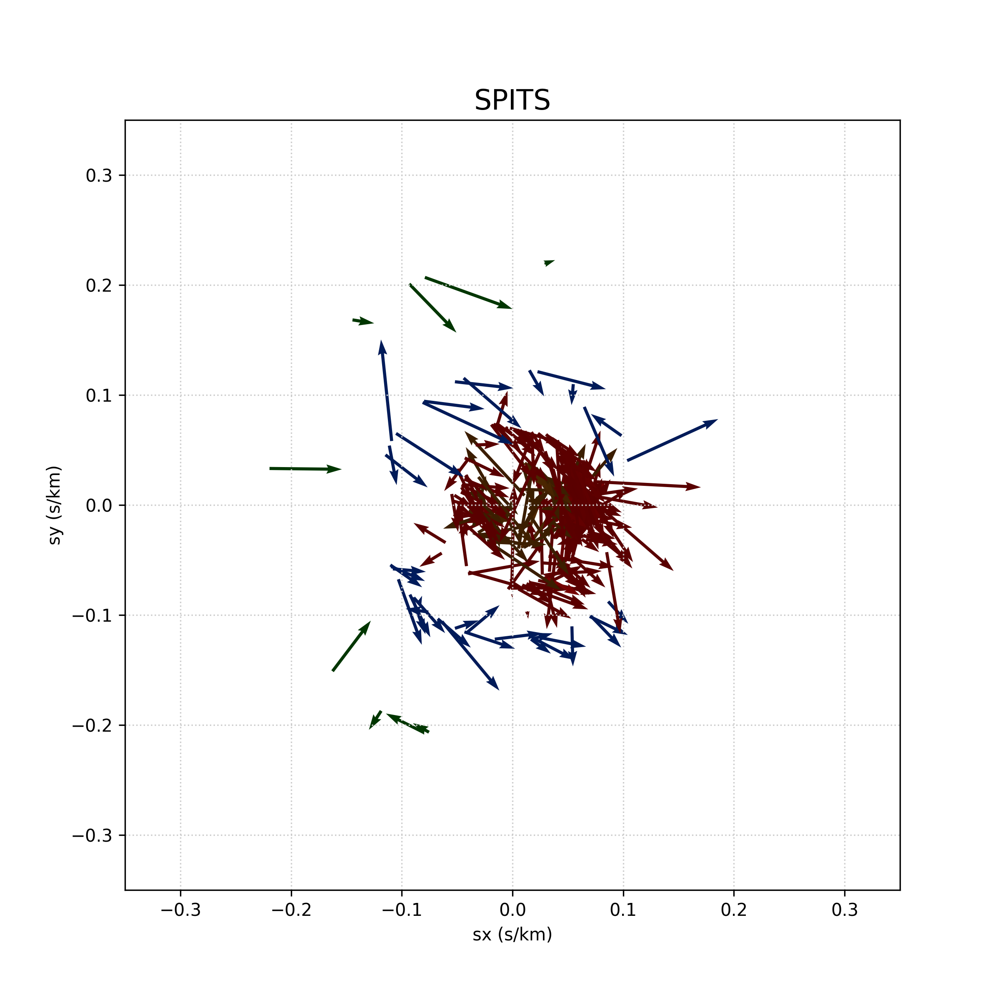

A folder in which we compute the differences between the measured slownesses (sx,sy) and those predicted using the AK135 model.  

We assume that we have collected files **{station}_all_arrivals.txt** in the folder **../collect_all_results_files** e.g.
```
../collect_all_results_files/AKASG_all_arrivals.txt
../collect_all_results_files/ARCES_all_arrivals.txt
../collect_all_results_files/ASAR_all_arrivals.txt
../collect_all_results_files/BRTR_all_arrivals.txt
../collect_all_results_files/BVAR_all_arrivals.txt
../collect_all_results_files/CMAR_all_arrivals.txt
../collect_all_results_files/EKA_all_arrivals.txt
../collect_all_results_files/ESDC_all_arrivals.txt
../collect_all_results_files/FINES_all_arrivals.txt
```

and we can then run the python script **add_AK135_slowness.py** using, e.g.  
```
#!/bin/sh
for station in \
    SPITS
do
  python add_AK135_slowness.py ${station}
done
```

and this should generate **SPITS_all_arrivals_with_AK135sxsy.txt**  
```
SPITS  68.98 347.8 P        2000-02-25T06:23:49.907  80.3  8.5 07.0    3678721   60555288  78.1777   16.3700   24.6984   122.0431   69.57  347.80   13.07   0.075400   0.012888   10.73       0.052408       0.019522
SPITS  38.25 354.5 P        2000-02-25T18:42:58.907 331.0 22.8  4.8    3678768   60555625  78.1777   16.3700   40.5494    33.2036  159.18  354.50    4.87  -0.099475   0.179458  171.82       0.026932      -0.070824
SPITS  80.57  11.5 P        2000-03-28T00:38:21.857  89.9  1.3  5.8    3856287   61634082  78.1777   16.3700    6.2643   -57.3641  255.31   11.50   85.48   0.011699   0.000020 -165.41      -0.046700      -0.012243
SPITS  49.78 344.9 P        2000-03-28T01:55:22.825 105.5  8.5  7.9    3856296   61634155  78.1777   16.3700   44.0855   120.2282   65.97  344.90   13.07   0.073712  -0.020442   39.53       0.062545       0.027886
SPITS  80.69  11.5 P        2000-03-28T02:41:37.107 171.7  2.1  6.4    3856301   61634178  78.1777   16.3700   12.8400   -89.8327  288.42   11.50   52.91   0.002728  -0.018701 -116.72      -0.045719       0.015226
SPITS  75.41 350.2 P        2000-03-28T11:35:29.132 109.2  2.1  5.2    3856325   61634428  78.1777   16.3700    7.7024    69.8875  124.58  350.20   52.91   0.017847  -0.006215  -15.38       0.042548      -0.029330
SPITS  84.04 350.9 P        2000-03-28T14:49:27.532  83.5  2.4  4.5    3856351   61634626  78.1777   16.3700   13.6734   146.2117   48.60  350.90   46.30   0.021459   0.002445   34.90       0.034418       0.030344
SPITS  46.46 349.1 P        2000-03-28T18:04:16.114 160.6  3.8  3.4    3856377   61634920  78.1777   16.3700   52.9032   154.3731   33.83  349.10   29.24   0.011359  -0.032256  126.77       0.039332       0.058686
SPITS  50.36 357.2 P        2000-05-04T03:10:26.857 236.9 11.3  2.7    3976190   63770496  78.1777   16.3700   51.3006  -174.2058    8.57  357.20    9.83  -0.085189  -0.055534 -131.67       0.010147       0.067330
SPITS  94.67 348.6 P        2000-05-04T04:50:50.288  82.7  6.1  5.8    3976196   63770604  78.1777   16.3700   -8.0540    90.4279  107.21  348.60   18.22   0.054451   0.006975  -24.51       0.039366      -0.012193
```
which has the measured sx in column 18, the measured sy in column 19,
the AK135-predicted sx in column 21, and the AK135-predicted sy in column 22.  

These files can get very long if we use every single arrival, so we have a python script **bin_sxsy.py** that
loops around all of the **_all_arrivals_with_AK135sxsy.txt** files and creates files such as **SPITS_binned_sxsy.txt**
```
  -0.02940   -0.06971    0.01877    0.03627      3
  -0.02282   -0.06773    0.04581    0.06013      1
  -0.02085   -0.06791    0.01576    0.04502      9
  -0.01528   -0.06971    0.02338    0.03845      1
  -0.01176   -0.06963    0.01127    0.04733      6
  -0.00870   -0.06982    0.02311    0.04478     33
  -0.00564   -0.06968    0.02735    0.05217     13
  -0.00051   -0.06992    0.00129    0.01795      1
   0.00206   -0.06926    0.01961    0.08229      3
```
which give 
```
median_theoretical_sx  median_theoretical_sy  median_measured_sx  median_measured_sy  number_of_elements_in_bin
```

We make plots of all of the **_binned_sxsy.txt** files using
```
python plot_sxsy_vectors_by_velocity.py
```
which gives images like  

 

Finally, we try to solve for the strike and dip in the **snells_law** folder

