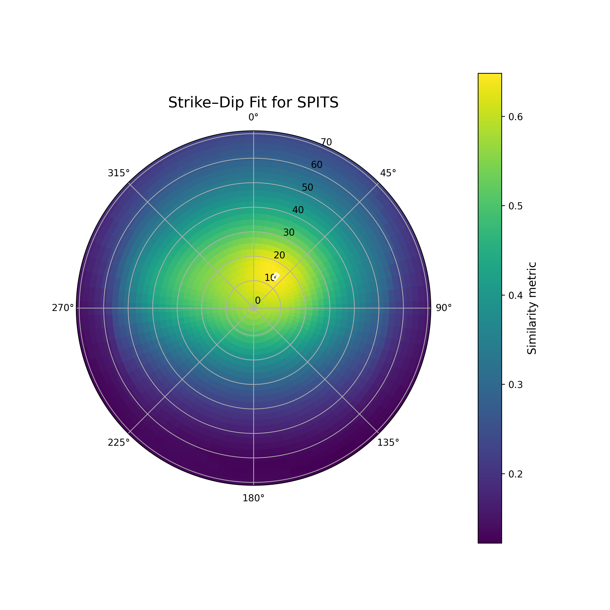

In this folder, we search a parameter space of strike and dip (and wave speed ratios) to find the parameters that best explain the
slowness vector deviations calculated in the **../*_binned_sxsy.txt** files.  

The main script is called **sa_analyze_binned_file_elementwise.py** and this is called using, e.g.  
```
#!/bin/sh
for binnedfile in ../SPITS*_binned_sxsy.txt
do
  if test -r ${binnedfile}
  then
     echo  ${binnedfile}
     # python sa_analyze_binned_file.py \
     python sa_analyze_binned_file_elementwise.py \
         --file  ${binnedfile}    \
         --alpha1 1.39 \
         --alpha2 1.80 \
         --numstrike 36 \
         --maxdip 70 \
         --numdip 15
  fi
done
```

and this will generate a plot of the form  

   

from which we conclude that a strike over around 35 degrees and a dip of around 13 degrees best explains the observations.  

We can use a script like **run_analyze_files_multiple.sh** together with a parameter file of the form **alpha1_alpha2.txt**  
```
 1.39     1.90
 1.39     1.95
 1.39     2.00
 1.39     2.05
 1.39     2.10
 1.39     2.15
 1.39     2.20
 1.39     2.25
 1.39     2.50
```
to search a wider parameter space.  

If we have a favoured value of **alpha1**, **alpha2**, **strike** and **dip** for a given station then we can calculate a predicted azi and vel from a theoretical

```
python theoretical_to_observed.py  10.0 315.0  1.39  1.85  35  13
Normal = ( -0.15038373318043533 , 0.08682408883346517 , 0.9848077530122081 )
p_above: (0.05, 0.0, -0.15898986690282427)
p_below: (0.04360184553524895, 0.003693976202540826, -0.11709070674368376)
||p_above|| ~ 0.16666666666666666 ||p_below|| ~ 0.125
Now in the other direction
p_above_returned: (0.05, 1.734723475976807e-18, -0.15898986690282424)

INPUT
------
  vapp_theoretical    = 10.0000 km/s
  backazi_theoretical = 315.000°
  alpha1 = 1.39,  alpha2 = 1.85
  strike = 35.0°, dip = 13.0°
  Using AK135 velocity: 5.80 km/s

PREDICTED
----------
  vapp_predicted      = 14.9153 km/s
  backazi_predicted   = 320.011°
```

In the folder **theo_2_observed_tests** we try to compare the output with published results.  

