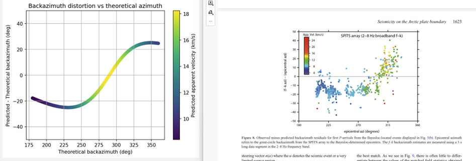

Folder containing tests to compare with previously published results.  
This is work in progress.  

The script **multiple_azi_vel_predict.py**  selects a set of parameters, an apparent velocity, and a range of backazimuth  

```
python multiple_azi_vel_predict.py   alpha1   alpha2   strike   dip   azilo delazi azihi   theo_appvel
```
for example  
```
python multiple_azi_vel_predict.py  1.39  2.00  20.0  15.0   180  1.0  360.0  10.0
```
and we end up with a similar picture for the SPITS array that we observe in  
Gibbons et al. (2017), (https://doi.org/10.1093/gji/ggx398)

  

